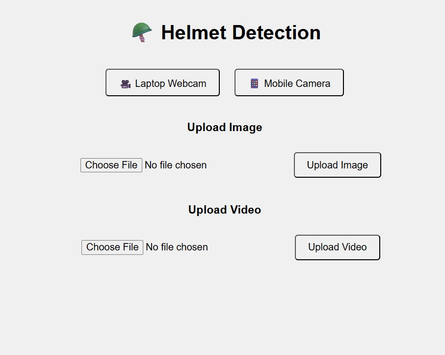

# helmet-violation_mlops_project

🪖 Helmet Violation Detection System
A real-time Helmet Detection application built using YOLOv8, FastAPI, Docker, and MLOps best practices. This system detects whether a person riding a two-wheeler is wearing a helmet and provides endpoints to process images, videos, and live webcam feeds.

🚀 Features
🔍 YOLOv8 model for accurate helmet detection.

⚡ FastAPI web server with REST endpoints.

🖼️ Upload and detect from images, videos, and webcam.

💻 Responsive Jinja2 templates for web and mobile UIs.

🐳 Dockerized for easy deployment.

📦 MLOps structure with model tracking and versioning.

📁 Auto-save predictions on videos.

🌐 CORS enabled API.

🛠️ Tech Stack
Component	Technology
Model	YOLOv8 (Ultralytics)
Backend	FastAPI
Frontend	Jinja2
Packaging	Docker
Model Handling	dill, PyYAML
Logging	Python logging
Deployment	Render / Docker
